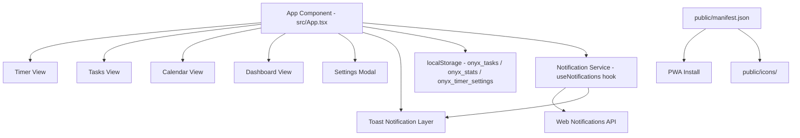

# Design Document: FocusFlow Enhancements

## Overview

This document describes the technical design for seven incremental enhancements to the FocusFlow Pomodoro productivity app. The app is a single-file React + TypeScript + Vite application (`src/App.tsx`, ~737 lines) using Tailwind CSS, lucide-react, motion/react, and recharts. All state is persisted to localStorage under the keys `onyx_tasks` and `onyx_stats`.

The enhancements are:
1. Sub-task UI in Task Dashboard (expand/collapse, add/edit/delete/reorder, progress bar)
2. Calendar task management with color-coded status
3. Due date visibility across all views with urgency color coding
4. Favicon + PWA branding
5. Custom timer durations with settings UI and localStorage persistence
6. App title fix (`index.html` → "FocusFlow")
7. Real-time browser notifications with in-app toast fallback

All seven features are implemented within the existing single-file architecture. No new routes, build tools, or backend services are introduced.

---

## Architecture

The app follows a flat, single-component architecture. All state lives in the root `App` component and is passed down via props or accessed via closures. The design preserves this pattern — no new components are extracted to separate files unless strictly necessary for PWA assets.



### Key Architectural Decisions

- **Single file**: All React logic stays in `src/App.tsx`. PWA assets (manifest, icons) live in `public/`.
- **New localStorage key**: `onyx_timer_settings` stores custom timer durations separately from tasks/stats to avoid migration issues.
- **Notification deduplication**: A `useRef<Set<string>>` tracks dispatched notification keys within the session (cleared on page reload).
- **Toast fallback**: A simple `toasts` state array renders a fixed-position overlay when the Notifications API is unavailable or denied.
- **Custom timer durations**: The `MODES` constant is replaced with a derived value computed from state, so all timer logic automatically picks up custom durations.

---

## Components and Interfaces

### 1. Sub-Task UI (Feature 1)

The sub-task expand/collapse, add/edit/delete/reorder, and progress bar UI already exists in the Timer view's active task list. The Task Dashboard (`view === 'tasks'`) already has this UI too. The remaining gap is ensuring the inline add-subtask input is always visible (not just on hover) and that the progress bar is shown consistently.

No new state is needed — `expandedTasks`, `newSubTaskText`, `editingSubTaskId`, `editingSubTaskText`, and the handler functions (`addSubTask`, `toggleSubTask`, `deleteSubTask`, `editSubTask`, `saveSubTaskEdit`, `reorderSubTask`, `getTaskProgress`) are all already implemented.

The design change is purely in the JSX render of the tasks view to ensure:
- The expansion toggle is shown for all tasks with subTasks (already done).
- The inline add-subtask input is always visible when expanded (already done).
- The progress bar is rendered on every task card that has subTasks (already done).

**Assessment**: Feature 1 is largely implemented. The task is to audit and fill any gaps in the Task Dashboard view specifically.

### 2. Calendar Color-Coded Status (Feature 2)

A helper function `getTaskStatusColor(task: Task, today: string): string` returns a Tailwind class string:

```ts
function getTaskStatusColor(task: Task, today: string): string {
  if (task.completed) return 'bg-emerald-500/20 text-emerald-400';
  if (task.dueDate && task.dueDate < today) return 'bg-red-500/20 text-red-400';
  return 'bg-amber-500/20 text-amber-400'; // in-progress / future
}
```

The calendar month/week/day views replace the current hardcoded `bg-white/5 text-white/80` / `bg-emerald-500/10` classes with calls to this helper.

Sub-task expansion in calendar cells uses the existing `expandedTasks` state and `toggleExpanded` handler. The inline add-task form for empty date cells replaces the current behavior of navigating to the tasks view.

### 3. Due Date Visibility (Feature 3)

A helper `getDueDateLabel(dueDate: string | undefined, today: string)` returns `{ label: string; colorClass: string } | null`:

```ts
function getDueDateLabel(dueDate: string | undefined, today: string) {
  if (!dueDate) return null;
  const d = new Date(dueDate + 'T00:00:00');
  const label = d.toLocaleDateString(undefined, { month: 'short', day: 'numeric' });
  if (dueDate < today) return { label, colorClass: 'text-red-400' };
  if (dueDate === today) return { label, colorClass: 'text-amber-400' };
  return { label, colorClass: 'text-white/40' };
}
```

This helper is called in every task card render across all four views (dashboard active tasks, timer task list, tasks view, calendar view).

A date picker input is added to the task row in the tasks view to allow updating an existing task's due date.

### 4. Favicon + PWA Branding (Feature 4)

Assets placed in `public/`:
- `public/manifest.json`
- `public/icons/icon-192.png`
- `public/icons/icon-512.png`
- `public/icons/apple-touch-icon.png` (180×180px)
- `public/favicon.ico` (replaces default Vite favicon)

`index.html` gets `<link rel="manifest" href="/manifest.json">`, `<link rel="icon" href="/favicon.ico">`, and `<link rel="apple-touch-icon" href="/icons/apple-touch-icon.png">` tags.

Since this is a design-only environment (no image generation), the icons will be SVG-based PNGs generated via a small inline script or placeholder. The manifest structure is:

```json
{
  "name": "FocusFlow",
  "short_name": "FocusFlow",
  "start_url": "/",
  "display": "standalone",
  "theme_color": "#050505",
  "background_color": "#050505",
  "icons": [
    { "src": "/icons/icon-192.png", "sizes": "192x192", "type": "image/png" },
    { "src": "/icons/icon-512.png", "sizes": "512x512", "type": "image/png" },
    { "src": "/icons/apple-touch-icon.png", "sizes": "180x180", "type": "image/png", "purpose": "any" }
  ]
}
```

### 5. Custom Timer Durations (Feature 5)

New interface and state:

```ts
interface TimerSettings {
  work: number;      // minutes
  shortBreak: number;
  longBreak: number;
}

const DEFAULT_TIMER_SETTINGS: TimerSettings = { work: 25, shortBreak: 5, longBreak: 15 };
```

State initialization:
```ts
const [timerSettings, setTimerSettings] = useState<TimerSettings>(() => {
  const saved = localStorage.getItem('onyx_timer_settings');
  return saved ? JSON.parse(saved) : DEFAULT_TIMER_SETTINGS;
});
```

The `MODES` constant becomes a derived value:
```ts
const modes = useMemo(() => ({
  work: { ...MODES_META.work, duration: timerSettings.work * 60 },
  shortBreak: { ...MODES_META.shortBreak, duration: timerSettings.shortBreak * 60 },
  longBreak: { ...MODES_META.longBreak, duration: timerSettings.longBreak * 60 },
}), [timerSettings]);
```

The settings modal gains a "Timer Durations" section with three `<input type="number" min="1" max="120">` fields and a "Reset to Defaults" button. Validation shows an inline error if a value is outside 1–120. On save, `localStorage.setItem('onyx_timer_settings', JSON.stringify(timerSettings))` is called.

### 6. App Title Fix (Feature 6)

Single-line change to `index.html`: `<title>My Google AI Studio App</title>` → `<title>FocusFlow</title>`.

### 7. Real-Time Notifications (Feature 7)

A `useNotifications` custom hook encapsulates all notification logic:

```ts
function useNotifications(tasks: Task[]) {
  const permissionRef = useRef<NotificationPermission>('default');
  const sentRef = useRef<Set<string>>(new Set());
  const [toasts, setToasts] = useState<{ id: string; message: string }[]>([]);

  // Request permission on mount
  // Check due/overdue tasks on mount and when tasks change
  // Expose: notify(key, title, body), toasts, dismissToast
}
```

Notification deduplication key format:
- Timer end: `timer-end-{mode}-{YYYY-MM-DD}`
- Due today: `due-today-{taskId}-{YYYY-MM-DD}`
- Overdue: `overdue-{taskId}-{YYYY-MM-DD}`

The `sentRef` Set persists only for the session (in-memory ref, not localStorage).

The `notify` function:
1. Checks `sentRef` — if key already sent, returns.
2. If `Notification.permission === 'granted'`, fires `new Notification(title, { body, icon: '/icons/icon-192.png' })`.
3. Otherwise, pushes to `toasts` state.
4. Adds key to `sentRef`.

Toast UI: fixed bottom-right overlay, auto-dismiss after 5 seconds, manual dismiss button.

A notification status badge (bell icon) is shown in the header when permission is granted.

---

## Data Models

### Existing (unchanged)

```ts
interface SubTask {
  id: string;
  text: string;
  completed: boolean;
  createdAt: number;
  parentId: string;
}

interface Task {
  id: string;
  text: string;
  completed: boolean;
  priority: Priority;
  createdAt: number;
  dueDate?: string;       // ISO date YYYY-MM-DD
  parentId?: string;
  subTasks: SubTask[];
}

interface DailyStat {
  date: string;
  sessions: number;
  focusMinutes: number;
  tasksCompleted: number;
  subTasksCompleted: number;
}
```

### New

```ts
interface TimerSettings {
  work: number;       // minutes, 1–120
  shortBreak: number; // minutes, 1–120
  longBreak: number;  // minutes, 1–120
}

interface Toast {
  id: string;
  message: string;
}
```

### localStorage Keys

| Key | Type | Purpose |
|-----|------|---------|
| `onyx_tasks` | `Task[]` | All tasks (existing) |
| `onyx_stats` | `DailyStat[]` | Activity stats (existing) |
| `onyx_timer_settings` | `TimerSettings` | Custom timer durations (new) |

---

## Correctness Properties

*A property is a characteristic or behavior that should hold true across all valid executions of a system — essentially, a formal statement about what the system should do. Properties serve as the bridge between human-readable specifications and machine-verifiable correctness guarantees.*


### Property 1: Sub-task toggle is a round trip

*For any* task with one or more subTasks, calling `toggleExpanded(taskId)` twice should leave `expandedTasks` in the same state as before both calls.

**Validates: Requirements 1.2, 1.3**

### Property 2: Adding a non-empty sub-task grows the subTasks array

*For any* task and any non-empty, non-whitespace string, calling `addSubTask(taskId)` should increase `task.subTasks.length` by exactly one and the new subTask's text should equal the trimmed input.

**Validates: Requirements 1.5**

### Property 3: Adding an empty or whitespace-only sub-task is a no-op

*For any* task and any string composed entirely of whitespace (including the empty string), calling `addSubTask(taskId)` should leave `task.subTasks` unchanged.

**Validates: Requirements 1.6**

### Property 4: Sub-task completion toggle is a round trip

*For any* task and any subTask, calling `toggleSubTask(taskId, subTaskId)` twice should return the subTask's `completed` field to its original value.

**Validates: Requirements 1.7**

### Property 5: Task progress percentage is correct

*For any* task, `getTaskProgress(task).percentage` should equal `Math.round((completedCount / totalCount) * 100)` where `completedCount` is the number of subTasks with `completed === true` and `totalCount` is `task.subTasks.length`. When `totalCount` is zero, percentage should be zero.

**Validates: Requirements 1.8**

### Property 6: Deleting a sub-task removes it from the array

*For any* task and any subTask id present in `task.subTasks`, calling `deleteSubTask(taskId, subTaskId)` should result in no subTask with that id remaining in `task.subTasks`.

**Validates: Requirements 1.9**

### Property 7: Sub-task reorder swaps adjacent items

*For any* task with at least two subTasks, calling `reorderSubTask(taskId, subTaskId, 'down')` followed by `reorderSubTask(taskId, subTaskId, 'up')` should return the subTasks array to its original order.

**Validates: Requirements 1.12**

### Property 8: Calendar groups tasks by due date

*For any* set of tasks with due dates, `getDaysInMonth` should place each task in exactly the day cell whose `date` field matches the task's `dueDate`. Tasks without a `dueDate` should not appear in any cell.

**Validates: Requirements 2.1**

### Property 9: Task status color-coding is correct

*For any* task and today's date string, `getTaskStatusColor(task, today)` should return:
- a green class when `task.completed === true`
- a red class when `task.completed === false` and `task.dueDate < today`
- an amber/yellow class when `task.completed === false` and `task.dueDate >= today`

This property applies equally to SubTask indicators.

**Validates: Requirements 2.6, 2.7**

### Property 10: Due date label color reflects urgency

*For any* due date string and today's date string, `getDueDateLabel(dueDate, today)` should return:
- `colorClass: 'text-red-400'` when `dueDate < today`
- `colorClass: 'text-amber-400'` when `dueDate === today`
- `colorClass: 'text-white/40'` when `dueDate > today`
- `null` when `dueDate` is undefined

**Validates: Requirements 3.1, 3.2, 3.3, 3.4, 3.5, 3.6, 3.7**

### Property 11: Custom timer duration validation rejects out-of-range values

*For any* integer value outside the range [1, 120], attempting to save it as a timer duration should leave `timerSettings` unchanged and produce a validation error.

**Validates: Requirements 5.4**

### Property 12: Custom timer settings round-trip through localStorage

*For any* valid `TimerSettings` object (all values in [1, 120]), saving it to localStorage and then reading it back should produce an equivalent object.

**Validates: Requirements 5.5, 5.6**

### Property 13: Resetting timer settings restores defaults

*For any* modified `timerSettings` state, calling the reset action should set `timerSettings` to `{ work: 25, shortBreak: 5, longBreak: 15 }`.

**Validates: Requirements 5.7**

### Property 14: Notification deduplication within a session

*For any* notification key, calling `notify(key, title, body)` multiple times within the same session should result in at most one actual notification being dispatched (i.e., the key is added to `sentRef` after the first call and subsequent calls are no-ops).

**Validates: Requirements 7.6**

### Property 15: Toast fallback when Notifications API is unavailable

*For any* timer completion event when `typeof Notification === 'undefined'` or permission is `'denied'`, the `toasts` array should gain a new entry containing the completion message.

**Validates: Requirements 7.8**

---

## Error Handling

### Timer Duration Validation
- Input values outside [1, 120] display an inline error message adjacent to the offending field.
- The save button is disabled while any field has a validation error.
- On blur, fields snap back to the last valid value if the current value is invalid.

### Notification Permission Denial
- If `Notification.requestPermission()` resolves to `'denied'`, the app sets a flag in component state and skips all future permission requests for the session.
- All notification paths fall through to the toast fallback.

### localStorage Parse Errors
- `onyx_timer_settings` is wrapped in a try/catch on read; if parsing fails, `DEFAULT_TIMER_SETTINGS` is used.
- This prevents a corrupted settings entry from breaking the timer.

### Missing PWA Assets
- If icon files are missing, the browser silently ignores the manifest icons array. The app still functions as a normal web app.

### Notification API Absence
- `typeof Notification === 'undefined'` guard prevents runtime errors in environments without the API (e.g., some mobile browsers).

---

## Testing Strategy

### Dual Testing Approach

Both unit tests and property-based tests are required. Unit tests cover specific examples and integration points; property tests verify universal correctness across randomized inputs.

### Property-Based Testing Library

**vitest** (already compatible with the Vite setup) + **fast-check** for property-based testing.

Install: `npm install --save-dev vitest @testing-library/react @testing-library/user-event fast-check`

Each property test runs a minimum of **100 iterations** via fast-check's default runner.

### Property Test Tags

Each property test must include a comment in the format:
```
// Feature: focusflow-enhancements, Property N: <property_text>
```

### Property Tests (one per property)

| Property | Test Description | fast-check Arbitraries |
|----------|-----------------|----------------------|
| P1 | Toggle expand twice = no-op | `fc.array(fc.record({id, subTasks: fc.array(...)}))` |
| P2 | Add non-empty subTask grows array | `fc.string({minLength:1})` filtered to non-whitespace |
| P3 | Add whitespace subTask is no-op | `fc.stringOf(fc.constantFrom(' ', '\t', '\n'))` |
| P4 | Toggle subTask completion twice = no-op | `fc.boolean()` for initial completed state |
| P5 | Progress percentage formula | `fc.array(fc.boolean())` for completed states |
| P6 | Delete subTask removes it | `fc.uuid()` for subTask id |
| P7 | Reorder down then up = identity | `fc.array(fc.string(), {minLength:2})` |
| P8 | Calendar groups by dueDate | `fc.array(fc.record({dueDate: fc.date()}))` |
| P9 | Status color correctness | `fc.record({completed, dueDate})` × `fc.date()` for today |
| P10 | Due date label color | `fc.date()` for dueDate × `fc.date()` for today |
| P11 | Duration validation rejects out-of-range | `fc.integer().filter(n => n < 1 \|\| n > 120)` |
| P12 | Timer settings localStorage round-trip | `fc.record({work, shortBreak, longBreak}: fc.integer({min:1,max:120}))` |
| P13 | Reset restores defaults | Any modified TimerSettings |
| P14 | Notification dedup | `fc.string()` for key, `fc.integer({min:2,max:10})` for call count |
| P15 | Toast fallback | `fc.constantFrom('work','shortBreak','longBreak')` for mode |

### Unit Tests

- Manifest content: parse `public/manifest.json`, assert `name === 'FocusFlow'`, `theme_color === '#050505'`, icon paths present.
- HTML title: read `index.html`, assert `<title>FocusFlow</title>`.
- Icon files exist: assert `public/icons/icon-192.png`, `public/icons/icon-512.png`, `public/icons/apple-touch-icon.png` are present.
- Notification permission request: mock `Notification.requestPermission`, mount hook, assert it was called once.
- Timer end notification: mock `Notification` constructor, simulate `timeLeft === 0`, assert notification fired with correct title/body.
- Due today notification: create task with `dueDate === today`, mount hook, assert notification fired.
- Overdue notification: create task with `dueDate < today`, mount hook, assert notification fired.
